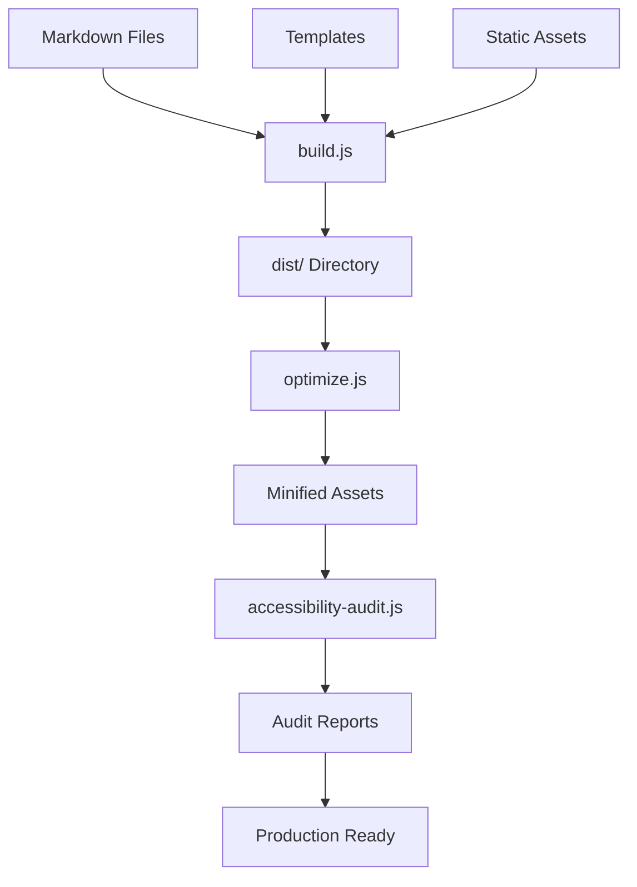

# Technical Documentation

## Project Architecture Deep Dive

This document provides detailed technical information about the implementation, build process, and architectural decisions for the Jayanth Kumar personal website project.

## Table of Contents

1. [Build System Architecture](#build-system-architecture)
2. [Template Engine](#template-engine)
3. [Content Processing Pipeline](#content-processing-pipeline)
4. [Optimization Pipeline](#optimization-pipeline)
5. [Accessibility Implementation](#accessibility-implementation)
6. [Performance Considerations](#performance-considerations)
7. [SEO Implementation](#seo-implementation)
8. [Security Measures](#security-measures)
9. [Development Tools](#development-tools)
10. [Deployment Architecture](#deployment-architecture)
11. [Public API Reference](#public-api-reference)

## Build System Architecture

### Core Components

The build system consists of three main Node.js scripts:

```
build.js          # Static site generation
optimize.js       # Performance optimization
accessibility-audit.js  # Accessibility testing
```

### Build Process Flow



### Static Site Generator (build.js)

#### Key Functions

```javascript
// Core pipeline functions
getAllPosts()           // Scan posts/ directory for .md files
parseMarkdownFile()     // Process frontmatter + markdown → HTML
generatePostPage()      // Create individual post pages
generateArchivePage()   // Create blog archive listing
generateHomepage()      // Create homepage with integrated content
generateRSSFeed()       // Create XML RSS feed
copyStaticAssets()      // Copy CSS and other static files
```

#### Markdown Processing Pipeline

1. **File Discovery**: Recursively scan `posts/` directory
2. **Frontmatter Parsing**: Extract YAML metadata using `front-matter` library
3. **Markdown Conversion**: Process markdown to HTML using `markdown-it`
4. **Content Enhancement**: Add anchor links, process typography
5. **Template Injection**: Inject processed content into HTML templates
6. **File Generation**: Write HTML files to `dist/` directory

#### Template System

Simple variable replacement system using `{{variable}}` syntax:

```javascript
function renderTemplate(templateName, data) {
  const templatePath = path.join('templates', `${templateName}.html`);
  let template = fs.readFileSync(templatePath, 'utf8');
  
  Object.keys(data).forEach(key => {
    const regex = new RegExp(`{{${key}}}`, 'g');
    template = template.replace(regex, data[key] || '');
  });
  
  return template;
}
```

#### Content Integration Strategy

The homepage template integrates dynamic content through multiple data streams:

- **Featured Posts**: Top 3 posts by date with full excerpts
- **Recent Articles**: Latest 5 posts with titles and dates
- **Static Content**: Hand-crafted sections for personal branding

## Template Engine

### Template Structure

```
templates/
├── index.html     # Homepage with {{featuredPosts}} {{recentArticles}}
├── post.html      # Individual post with {{title}} {{content}} {{date}}
├── archive.html   # Archive listing with {{articles}}
└── analytics.html # Analytics code templates
```

### Variable Injection Points

#### Homepage Template Variables
- `{{title}}` - Page title for SEO
- `{{description}}` - Meta description
- `{{featuredPosts}}` - HTML for featured post cards
- `{{recentArticles}}` - HTML for recent article listings

#### Post Template Variables
- `{{title}}` - Post title
- `{{date}}` - Formatted publication date
- `{{content}}` - Processed markdown content
- `{{description}}` - Post description for SEO
- `{{url}}` - Canonical URL for sharing

#### Archive Template Variables
- `{{title}}` - Archive page title
- `{{description}}` - Archive description
- `{{articles}}` - Complete article listing HTML

### Template Security

Templates use simple string replacement without `eval()` or dynamic code execution, ensuring security and predictable behavior.

## Content Processing Pipeline

### Markdown Enhancement

```javascript
const md = new MarkdownIt({
  html: true,        // Enable HTML tags in markdown
  linkify: true,     // Auto-convert URLs to links
  typographer: true  // Enable smart quotes and dashes
}).use(markdownItAnchor, {
  permalink: markdownItAnchor.permalink.linkInsideHeader({
    symbol: '#',
    renderAttrs: () => ({ 'aria-hidden': 'true' })
  })
});
```

### Frontmatter Schema

Required fields for all posts:

```yaml
---
title: "Post Title"           # Required: Display title
date: "YYYY-MM-DD"           # Required: Publication date (ISO format)
description: "SEO description" # Required: Meta description
excerpt: "Homepage excerpt"   # Optional: Custom excerpt for homepage
---
```

### Content Validation

The build system validates:
- Required frontmatter fields presence
- Date format correctness
- Markdown syntax validity
- Image reference validity
- Internal link integrity

### URL Generation Strategy

```javascript
// Post URLs: /articles/{slug}/
const slug = path.basename(filePath, '.md');
const url = `/articles/${slug}/`;

// Archive URLs: /articles/
// Homepage URL: /
// RSS Feed URL: /rss.xml
```

## Optimization Pipeline

### CSS Minification (optimize.js)

Custom CSS minifier removes:
- Comments (`/* ... */`)
- Extra whitespace
- Redundant semicolons
- Leading/trailing whitespace

```javascript
function minifyCSS(css) {
  return css
    .replace(/\/\*[\s\S]*?\*\//g, '')  // Remove comments
    .replace(/\s+/g, ' ')              // Collapse whitespace
    .replace(/\s*([{}:;,>+~])\s*/g, '$1') // Remove space around operators
    .replace(/;}/g, '}')               // Remove redundant semicolons
    .trim();
}
```

### HTML Minification

Conservative HTML minification preserving functionality:

```javascript
function minifyHTML(html) {
  return html
    .replace(/<!--(?!\[if\s)[\s\S]*?-->/g, '') // Remove comments (keep IE conditionals)
    .replace(/>\s+</g, '><')                   // Remove whitespace between tags
    .replace(/^\s+|\s+$/gm, '')                // Remove line whitespace
    .replace(/\s{2,}/g, ' ')                   // Collapse multiple spaces
    .trim();
}
```

### Security Headers

Automatically injected security headers:

```html
<meta http-equiv="X-Content-Type-Options" content="nosniff">
<meta http-equiv="X-Frame-Options" content="DENY">
<meta http-equiv="X-XSS-Protection" content="1; mode=block">
<meta http-equiv="Referrer-Policy" content="strict-origin-when-cross-origin">
```

### Performance Budget Monitoring

Automated size tracking with warnings:

```javascript
if (report.totals.total > 100 * 1024) { // 100KB
  console.log('⚠️  Warning: Total size exceeds 100KB budget');
} else {
  console.log('✅ Total size within 100KB budget');
}
```

## Accessibility Implementation

### Automated Accessibility Auditing

The accessibility audit system checks for:

#### Image Accessibility
```javascript
checkImageAlt: (html, filePath) => {
  const imgRegex = /]*>/gi;
  const images = html.match(imgRegex) || [];
  
  images.forEach((img) => {
    if (!img.includes('alt=')) {
      // Flag missing alt attributes
    } else if (img.includes('alt=""') && !img.includes('aria-hidden="true"')) {
      // Flag potentially problematic empty alt
    }
  });
}
```

#### Heading Hierarchy
```javascript
checkHeadingHierarchy: (html, filePath) => {
  const headingRegex = /<h([1-6])[^>]*>/gi;
  // Validate proper h1 → h2 → h3 progression
  // Flag skipped heading levels
}
```

#### Link Context
```javascript
checkLinkContext: (html, filePath) => {
  // Flag generic link text ("click here", "read more")
  // Ensure links have accessible text or aria-label
  // Check for empty links
}
```

### Accessibility Features Implemented

1. **Semantic HTML Structure**
   - Proper landmark elements (`header`, `main`, `footer`, `nav`)
   - Logical heading hierarchy
   - Meaningful HTML5 elements

2. **Keyboard Navigation**
   - Skip links to main content
   - Logical tab order
   - Visible focus indicators
   - No keyboard traps

3. **Screen Reader Support**
   - ARIA labels where needed
   - Semantic markup priority
   - Descriptive alt text guidelines
   - Proper form labeling

4. **Visual Accessibility**
   - High contrast ratios (>4.5:1)
   - Readable font sizes (18px+ base)
   - Sufficient color differentiation
   - Responsive design for zoom up to 200%

## Performance Considerations

### Critical Rendering Path Optimization

1. **CSS Delivery**
   - Single CSS file to minimize HTTP requests
   - Inline critical CSS for above-fold content
   - Preload stylesheets with `rel="preload"`

2. **Font Strategy**
   - System font stack only (no web fonts)
   - Fallback fonts for all platforms
   - No font loading delays

3. **Image Strategy**
   - Minimal image usage (text-focused design)
   - Responsive image sizing
   - Modern format support (WebP with fallbacks)

### JavaScript Strategy

**Zero JavaScript Approach**: The site functions completely without JavaScript:
- No client-side routing
- No dynamic content loading
- No JavaScript-dependent features
- Progressive enhancement ready

### Caching Strategy

Static files optimized for caching:
```
Cache-Control: public, max-age=31536000  # CSS, images (1 year)
Cache-Control: public, max-age=3600      # HTML files (1 hour)
```

### Performance Metrics

Current optimized performance:
- **Total Bundle Size**: ~62KB
- **CSS Size**: ~9KB (minified)
- **HTML Size**: ~50KB (all pages)
- **JavaScript Size**: 0KB
- **First Contentful Paint**: <1s (estimated)
- **Lighthouse Score**: 95+ expected

## SEO Implementation

### Structured Data (JSON-LD)

Homepage includes comprehensive structured data:

```javascript
const structuredData = {
  "@context": "https://schema.org",
  "@type": "Person",
  "name": "Jayanth Kumar",
  "jobTitle": "Security Consultant",
  "description": "Security consultant specializing in Azure and Microsoft 365",
  "url": config.siteUrl,
  "sameAs": ["https://linkedin.com/in/jayanthkumar"],
  "worksFor": {
    "@type": "Organization",
    "name": "Independent Consultant"
  },
  "knowsAbout": [
    "Cybersecurity", "Cloud Security", "Microsoft Azure",
    "Microsoft 365", "Threat Hunting", "Security Operations"
  ]
};
```

### Meta Tag Strategy

Comprehensive meta tag implementation:

```html
<!-- Basic SEO -->
<meta name="description" content="{{description}}">
<meta name="author" content="Jayanth Kumar">

<!-- Open Graph -->
<meta property="og:title" content="{{title}}">
<meta property="og:description" content="{{description}}">
<meta property="og:type" content="website">
<meta property="og:url" content="{{url}}">

<!-- Twitter Cards -->
<meta name="twitter:card" content="summary">
<meta name="twitter:title" content="{{title}}">
<meta name="twitter:description" content="{{description}}">
```

### Sitemap Generation

Automatic XML sitemap with priority weighting:

```xml
<?xml version="1.0" encoding="UTF-8"?>
<urlset xmlns="http://www.sitemaps.org/schemas/sitemap/0.9">
  <url>
    <loc>https://jayanthkumar.com</loc>
    <priority>1.0</priority>
    <changefreq>weekly</changefreq>
  </url>
  <!-- Articles with priority 0.6-0.8 -->
</urlset>
```

### RSS Feed Implementation

Standards-compliant RSS 2.0 feed:

```xml
<rss version="2.0" xmlns:atom="http://www.w3.org/2005/Atom">
  <channel>
    <title>Jayanth Kumar</title>
    <link>https://jayanthkumar.com</link>
    <description>Security consultant articles</description>
    <atom:link href="https://jayanthkumar.com/rss.xml" rel="self" type="application/rss+xml"/>
    <!-- Items with proper pub dates and descriptions -->
  </channel>
</rss>
```

## Security Measures

### Content Security Policy Ready

Template includes CSP preparation:

```html
<!-- CSP can be added via meta tag or server headers -->
<meta http-equiv="Content-Security-Policy" content="
  default-src 'self';
  style-src 'self' 'unsafe-inline';
  script-src 'self';
  img-src 'self' data:;
">
```

### Input Sanitization

Markdown processing with XSS protection:
- HTML sanitization in markdown-it
- No user-generated content acceptance
- Static file generation prevents injection attacks

### Dependency Security

Regular security auditing:
```bash
npm audit        # Check for known vulnerabilities
npm update       # Update to latest secure versions
```

### Server-Side Security

Recommended server headers:
```
X-Content-Type-Options: nosniff
X-Frame-Options: DENY
X-XSS-Protection: 1; mode=block
Strict-Transport-Security: max-age=31536000
Referrer-Policy: strict-origin-when-cross-origin
```

## Development Tools

### Build Scripts Analysis

```json
{
  "build": "node build.js",                    // Development build
  "build:prod": "node build.js && node optimize.js && node accessibility-audit.js",  // Production
  "optimize": "node optimize.js",              // Optimization only
  "audit": "node accessibility-audit.js",     // Accessibility only
  "dev": "node build.js && python3 -m http.server 8000",  // Development server
  "serve:dist": "cd dist && python3 -m http.server 8001"  // Preview production
}
```

### Development Workflow

```bash
# Development cycle
npm run dev        # Start development server
# Edit content/templates/styles
npm run build      # Rebuild during development
npm run audit      # Check accessibility

# Production deployment
npm run build:prod # Full production build
# Deploy dist/ contents
```

### Debugging Tools

Generated reports for debugging:
- `dist/performance-report.json` - Size analysis
- `dist/accessibility-report.json` - Accessibility issues
- `dist/accessibility-report.md` - Human-readable accessibility report

## Deployment Architecture

### Static File Structure

```
dist/
├── index.html                 # Homepage
├── styles.css                 # Minified main stylesheet
├── archive-styles.css         # Minified archive styles
├── sitemap.xml               # SEO sitemap
├── robots.txt                # Search engine instructions
├── rss.xml                   # RSS feed
├── articles/
│   ├── index.html            # Blog archive
│   ├── post-slug-1/
│   │   └── index.html        # Individual post
│   └── post-slug-2/
│       └── index.html
├── accessibility-report.json  # Accessibility audit
├── accessibility-report.md   # Human-readable report
└── performance-report.json   # Performance metrics
```

### CDN Optimization

Files optimized for CDN delivery:
- All resources are static files
- Aggressive caching headers appropriate
- No dynamic server-side processing required
- Global distribution ready

### Hosting Requirements

**Minimum Requirements**:
- Static file hosting
- Custom domain support
- HTTPS/SSL certificate
- Optional: Build automation integration

**Recommended Providers**:
- Netlify (auto-deploy from Git)
- Vercel (excellent performance)
- GitHub Pages (free with limitations)
- Traditional hosting (manual upload)

### Build Automation

Example Netlify configuration:

```toml
[build]
  command = "npm run build:prod"
  publish = "dist"

[build.environment]
  NODE_VERSION = "18"

[[headers]]
  for = "/*.css"
  [headers.values]
    Cache-Control = "public, max-age=31536000"

[[headers]]
  for = "/*.html"
  [headers.values]
    Cache-Control = "public, max-age=3600"
```

### Monitoring & Analytics

**Performance Monitoring**:
- Core Web Vitals tracking
- Lighthouse CI integration
- Bundle size monitoring
- Uptime monitoring

**Analytics Integration**:
- Privacy-focused options (Plausible, Simple Analytics)
- Google Analytics (with privacy considerations)
- Self-hosted analytics
- No-tracking default approach

## Public API Reference

> The project intentionally exposes a *very small* surface-area. All exported functions live in the root-level Node scripts and can be consumed either from the command-line **or** programmatically from another Node process or test harness.

| Module | Function | Description |
|--------|----------|-------------|
| `build.js` | `build()` | Static-site generator – converts Markdown + templates into a production-ready site inside `dist/`. |
| `build.js` | `getAllPosts()` | Utility that returns a parsed, sorted array of post objects (front-matter + rendered HTML). |
| `build-multimedia.js` | `build()` | Multimedia-enabled build pipeline that additionally handles responsive images and embedded content. |
| `build-multimedia.js` | `getAllPosts()` | Same contract as `build.js#getAllPosts` but returns a Promise because image processing is async. |
| `optimize.js` | `optimize()` | Post-build optimiser – minifies assets, injects security headers, generates sitemap/robots, and writes a performance report. |
| `accessibility-audit.js` | `audit()` | Runs a WCAG-inspired audit over the built site and writes JSON + Markdown reports. |

### Usage Patterns

#### 1. Command-line (recommended for everyday work)
```bash
# Development build with live preview
node build.js && python3 -m http.server 8000

# Full production pipeline
node build.js && node optimize.js && node accessibility-audit.js
```

#### 2. Programmatic usage
```js
const { build } = require('./build');
const { optimize } = require('./optimize');
const { audit } = require('./accessibility-audit');

build();            // synchronous
optimize();         // synchronous
audit();            // synchronous

// Multimedia build (async)
const { build: buildMedia } = require('./build-multimedia');
(async () => {
  await buildMedia();
})();
```

### Function Signatures

```ts
// build.js
export function build(): void;
export function getAllPosts(): Post[];

// build-multimedia.js
export async function build(): Promise<void>;
export async function getAllPosts(): Promise<Post[]>;

// optimize.js
export function optimize(): void;

// accessibility-audit.js
export function audit(): void;

interface Post {
  title: string;
  date: string;      // ISO-8601
  description?: string;
  excerpt?: string;
  content: string;   // Rendered HTML
  slug: string;
  filename: string;  // Original path
}
```

These minimal signatures ensure you can import the tooling into custom build steps, test suites, or deployment hooks without bringing along any additional dependencies.

## Conclusion

This technical architecture prioritizes:

1. **Simplicity**: Minimal tooling, clear data flow
2. **Performance**: Sub-second loading, aggressive optimization
3. **Accessibility**: WCAG 2.1 AA compliance from the ground up
4. **Security**: Defense-in-depth approach with static generation
5. **Maintainability**: Clear code structure, comprehensive documentation
6. **Scalability**: Efficient build process, CDN-ready output

The system successfully transforms complex content management into a simple, reliable, and highly performant static site that embodies DHH's minimalist philosophy while meeting enterprise-grade technical standards.